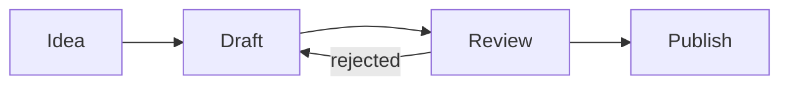

# Editing & Formatting (Obsidian Flavored Markdown)

This is the syntax surface area for everything Claude writes inside a `.md` note. Master it — Obsidian's polish comes from using these features correctly, not from raw text content.

## 1. Basic markdown — assumed baseline

```markdown
# H1   ## H2   ### H3   #### H4   ##### H5   ###### H6

**bold**   *italic*   ~~strikethrough~~   ==highlight==   `inline code`

> blockquote

- unordered
  - nested
1. ordered
   1. nested
- [ ] open task
- [x] done task

| col A | col B |
|:------|------:|
| left  | right |

---   (horizontal rule)
```

## 2. Code blocks (fenced, with language tags)

````markdown
```python
print("hello")
```
````

Obsidian renders syntax highlighting for most languages. Use language tags for `dataview`, `javascript` (Templater), `base` (visual hint), `mermaid`, `json`, `yaml`, `bash`, `css`.

## 3. Inline comments — `%%hidden%%`

`%%this won't render in Reading view%%` — useful for editor-only notes, TODOs you don't want to publish, or anchor comments next to YAML.

## 4. Math — LaTeX inline and block

Inline: `$E = mc^2$`
Block:

```markdown
$$
\int_{0}^{\infty} e^{-x^2}\,dx = \frac{\sqrt{\pi}}{2}
$$
```

## 5. Mermaid diagrams

Fenced code block with language `mermaid`. Supported diagram types: `flowchart`, `sequenceDiagram`, `gantt`, `mindmap`, `classDiagram`, `stateDiagram-v2`, `pie`, `journey`.

````markdown

````

## 6. Callouts — the workhorse of OFM

Syntax: `> [!TYPE] Optional Title` then continuation lines starting with `>`.

```markdown
> [!NOTE] This is the title
> Body of the callout. Can include **markdown**, [[links]], and even nested callouts.
```

### All supported types

| Type | Common use |
|---|---|
| `NOTE` | Default neutral note |
| `INFO` | Side information |
| `TIP` / `HINT` / `IMPORTANT` | Practical advice (aliases of TIP) |
| `SUCCESS` / `CHECK` / `DONE` | Positive outcomes |
| `WARNING` / `CAUTION` / `ATTENTION` | Risks, gotchas |
| `DANGER` / `ERROR` | Destructive risks |
| `FAILURE` / `FAIL` / `MISSING` | Failed states |
| `BUG` | Known issue |
| `QUESTION` / `HELP` / `FAQ` | Open questions |
| `EXAMPLE` | Worked example |
| `ABSTRACT` / `SUMMARY` / `TLDR` | Top-of-note summary |
| `QUOTE` / `CITE` | Quotation |
| `TODO` | Pending work |

### Foldable callouts

- `> [!NOTE]+ Title` — open by default, user can collapse.
- `> [!NOTE]- Title` — collapsed by default, user can expand.

### Nested callouts

```markdown
> [!ABSTRACT] Outer
> Some context.
>
> > [!WARNING]- Risks (collapsed)
> > Hidden by default. Click to expand.
```

### When to reach for which

- `> [!ABSTRACT]+` at the top of any long note — instant TL;DR.
- `> [!QUESTION]` for things you don't yet know — Dataview can later surface all open questions.
- `> [!WARNING]` for caveats inside templates — keeps the note honest.

## 7. Tags

```markdown
#standalone
#nested/parent/child
```

Rules:

- No spaces. Use hyphens or nested slashes.
- Lowercase. Pick a convention and stick.
- Nested tags create a hierarchy in the Tags view (`#area/health`, `#area/work` share a parent).
- Tags inside frontmatter use list syntax — see Properties below.

**Suggested taxonomy starter:**

```
#status/idea  #status/active  #status/paused  #status/done  #status/archived
#type/note    #type/project   #type/area      #type/resource  #type/moc
#area/{name}  #project/{slug} #person/{name}
```

## 8. Properties (YAML frontmatter)

Every system note (project, MOC, daily note, person, meeting, etc.) gets frontmatter. This is what Bases, Dataview, search filters, and Publish SEO all read from.

```yaml
---
title: "Q4 GTM Plan"
aliases: [Q4 plan, fall plan]
tags: [project, gtm, marketing]
created: 2026-05-15
modified: 2026-05-15T10:42
due: 2026-09-30
status: active
priority: 1
published: false
type: project
cssclasses: [wide-page]
---
```

### Property types Obsidian recognizes

| Type | YAML form | Notes |
|---|---|---|
| Text | `status: "active"` | Quotes optional unless value contains `:` or `#` |
| Number | `priority: 3` | No quotes |
| Date | `due: 2026-09-30` | ISO format, no quotes |
| Datetime | `created: 2026-05-15T10:42` | ISO 8601 |
| Checkbox (boolean) | `published: true` | `true` / `false` |
| List | `tags: [a, b, c]` or block form below | Use for tags, aliases, links |
| List of links | `related: ["[[Note A]]", "[[Note B]]"]` | Yes, the brackets must be inside quotes |

Block list form (preferred when long):

```yaml
related:
  - "[[Q3 Retrospective]]"
  - "[[Brand Refresh]]"
  - "[[Pricing 2026]]"
```

### Standard property vocabulary

Stick to these unless you have a reason not to:

- `title` — display title (overrides filename in some plugins)
- `aliases` — alternative names that appear in Quick Switcher and resolve `[[wikilinks]]`
- `tags` — list, never a single string
- `created`, `modified` — both ISO datetimes; Templater can autofill
- `date` — semantic date for the note's content (meeting date, journal date)
- `due`, `start`, `scheduled` — for tasks/projects
- `status` — controlled vocabulary (`idea` | `active` | `paused` | `done` | `archived`)
- `type` — note archetype (`project` | `area` | `resource` | `moc` | `meeting` | `daily` | `person`)
- `priority` — integer 1 (top) to 5 (bottom)
- `cssclasses` — list of CSS classes; styles them via snippets
- `cover` — image path for the note's hero image (used by some plugins / Publish)
- `description` — SEO/social card description (Publish)
- `permalink` — explicit URL slug (Publish)
- `publish` — boolean (some setups use this to gate Publish)

### Why properties beat inline conventions

Properties are queryable. `status: active` in YAML can be filtered by Bases, Dataview, and search. `**Status:** Active` inline cannot. Always lift state into frontmatter.

## 9. Attachments — embedding files

```markdown
![[image.png]]                ← embed full-size
![[image.png|400]]            ← width 400px
![[image.png|400x300]]        ← width × height
![[recording.mp3]]            ← audio player
![[clip.mp4]]                 ← video player
![[paper.pdf]]                ← PDF preview
![[paper.pdf#page=4]]         ← PDF starting on page 4
```

Drag-drop into the editor creates these automatically; the attachment folder is configurable in Settings → Files & Links → Default location for new attachments.

## 10. Embedding web content

Standard markdown links are clickable. To inline an iframe (videos, embeds, tools):

```markdown
<iframe src="https://www.youtube.com/embed/dQw4w9WgXcQ" width="640" height="360" allowfullscreen></iframe>
```

HTML works inside `.md` files — including `<details>` collapsibles, `<sub>`/`<sup>`, `<kbd>`. Obsidian respects most of it in Reading view.

## 11. View modes

| Mode | Behavior | When to suggest |
|---|---|---|
| Source | Raw markdown only | Power users editing complex syntax |
| Live Preview (default) | Rendered while editing | The normal experience |
| Reading view | Fully rendered, read-only | Reviewing, presenting, publishing |

Toggle with the icon in the tab bar or `Ctrl/Cmd+E`.

## 12. Editing affordances worth knowing

- **Fold headings** — click the chevron beside the heading; or `Ctrl/Cmd+Alt+number` to fold/unfold by level.
- **Fold list items** — click the gutter triangle; great for outlines.
- **Multiple cursors** — `Ctrl+click` (or `Cmd+click` on macOS) to add a cursor; `Ctrl+Alt+up/down` to add cursor above/below.
- **Move lines** — `Alt+up/down`.
- **Toggle checkbox** — `Ctrl/Cmd+L` on the current task line.

## 13. Output style — what Claude's notes should feel like

A well-formed Obsidian note from this skill should:

1. Open with **YAML frontmatter** if the note is part of a system.
2. Start with an **H1 title** matching `title:` (helpful for non-Obsidian rendering of the same `.md`).
3. Use a single **`> [!ABSTRACT]+` callout** as the TL;DR, immediately under the H1.
4. Organize the body with H2 headings — never skip levels.
5. Use **`==highlights==`** for the few phrases the user will most want to find on a re-read.
6. Use **`[[wikilinks]]`** for any concept that might become its own note someday — being generous here makes the graph richer.
7. End with a **`## Related`** section: bullet list of `[[notes]]` and a `tags:` line in frontmatter.

### Canonical template — apply to most "make me a note" requests

```markdown
---
title: "{{Title}}"
aliases: []
tags: [{{tag1}}, {{tag2}}]
created: {{date:YYYY-MM-DD}}
status: active
type: note
---

# {{Title}}

> [!ABSTRACT]+ TL;DR
> One-paragraph summary of the note.

## Context

What prompted this, what the situation is.

## Key points

- ...

## Open questions

> [!QUESTION] ...

## Related

- [[Related note]]
- [[Another concept]]

%%
created: {{date:YYYY-MM-DD}}
%%
```
